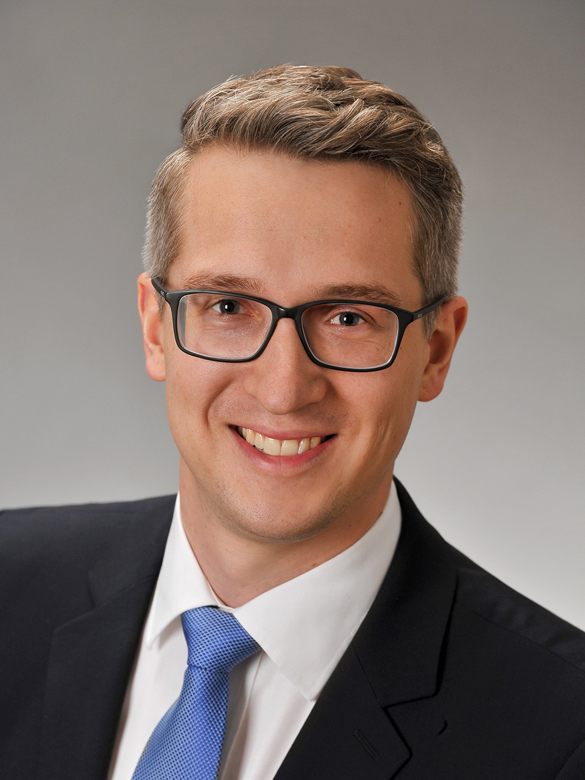

---
# Feel free to add content and custom Front Matter to this file.
# To modify the layout, see https://jekyllrb.com/docs/themes/#overriding-theme-defaults

layout: home
---

|  | **Dr.-Ing. Matthias Mayr** Computational Scientist, Lecturer, Developer of Research Software  ***Affiliation:*** [Institute for Mathematics and Computer-based Simulation, University of the Bundeswehr Munich](https://www.unibw.de/imcs-en) ***Work website:***: [www.unibw.de/matthias.mayr](http://www.unibw.de/matthias.mayr) ***Personal Website:*** [mayrmt.github.io](https://mayrmt.github.io) ***Work Email:*** [matthias.mayr@unibw.de](mailto:matthias.mayr@unibw.de) |

[comment]: <> (NOTE: the above single line for the figure and the side text is necessary for the formatting to work.  Any newline breaks this.)

Welcome to my personal site!
You'll find a complete list of my publications and presentations,
details about my research and scientific activities,
news about my open-source software development activities,
and some blog posts related to various topics in HPC, scientific computing, and collaborative code development.

For more details on my open-source contributions, see [my GitHub profile](https://github.com/mayrmt).

I also have some profiles as a researcher and author of scientific publications:

- [Scopus](https://www.scopus.com/authid/detail.uri?origin=resultslist&authorId=56533415400&zone=)
- [Google Scholar](https://scholar.google.de/citations?user=-U3wAecAAAAJ&hl=de)
- [Orcid](https://orcid.org/0000-0002-2780-1233)
- [Researchgate](https://www.researchgate.net/profile/Matthias_Mayr2)
